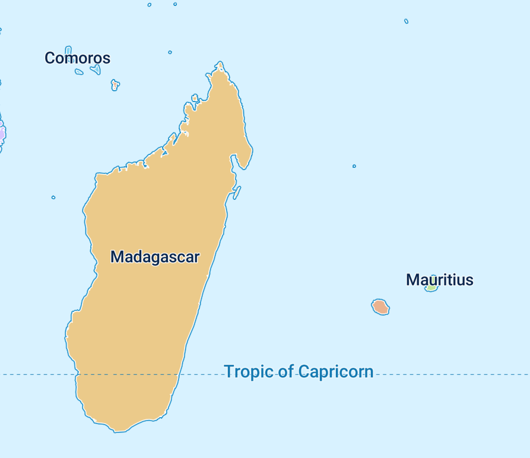

# double-resolution-font
Double resolution font with sharp(er) corners in MapLibre GL JS


```diff
 // in font-maker main.cpp
- const double scale_factor = 1.0;
+ const double scale_factor = 2.0;
```

Gives you nice sharp corners in text in MapLibre GL JS...



## Demo

https://wipfli.github.io/double-resolution-font/
